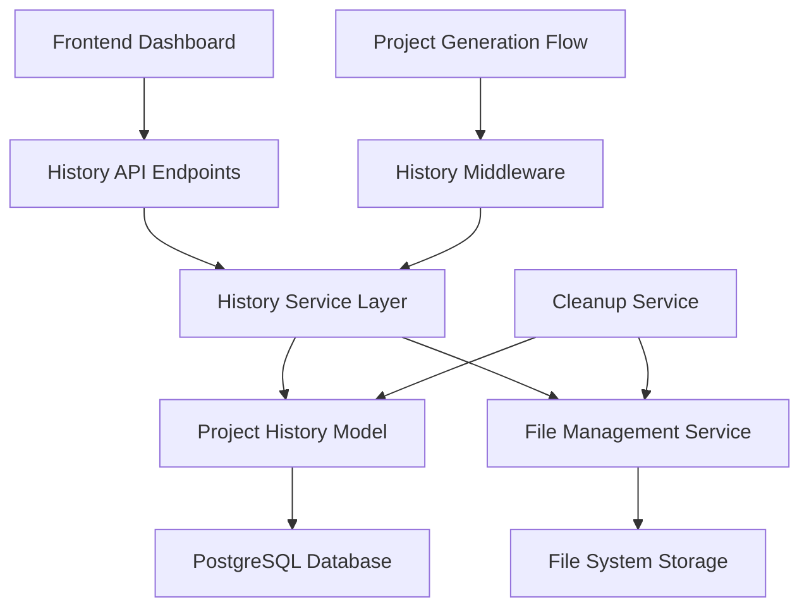
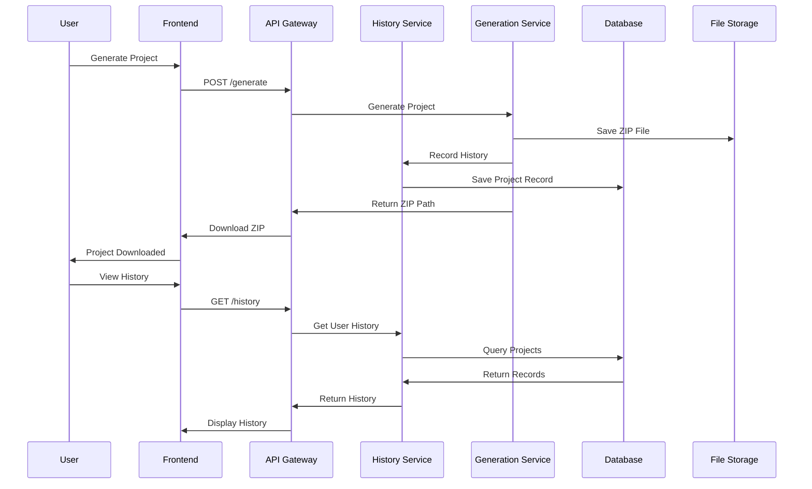
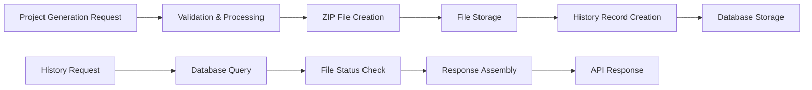
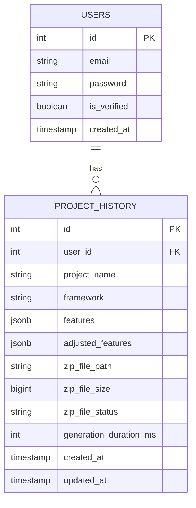

# Design Document

## Overview

The project history feature will be implemented as a comprehensive system that tracks, stores, and manages user-generated projects. The design follows a RESTful API architecture with proper data modeling, security, and performance considerations. The system will integrate seamlessly with the existing GoCraft backend while providing new endpoints for history management.

## Architecture

### High-Level Architecture



### Component Interaction Flow



## Components and Interfaces

### 1. Database Schema

#### ProjectHistory Table
```sql
CREATE TABLE project_history (
    id SERIAL PRIMARY KEY,
    user_id INTEGER NOT NULL REFERENCES users(id) ON DELETE CASCADE,
    project_name VARCHAR(100) NOT NULL,
    framework VARCHAR(20) NOT NULL,
    features JSONB NOT NULL,
    adjusted_features JSONB NOT NULL,
    zip_file_path VARCHAR(500),
    zip_file_size BIGINT,
    zip_file_status VARCHAR(20) DEFAULT 'available',
    generation_duration_ms INTEGER,
    created_at TIMESTAMP WITH TIME ZONE DEFAULT NOW(),
    updated_at TIMESTAMP WITH TIME ZONE DEFAULT NOW(),
    
    INDEX idx_project_history_user_id (user_id),
    INDEX idx_project_history_created_at (created_at),
    INDEX idx_project_history_framework (framework),
    INDEX idx_project_history_status (zip_file_status)
);
```

#### Enum for ZIP File Status
```sql
CREATE TYPE zip_file_status_enum AS ENUM (
    'available',
    'expired', 
    'deleted',
    'error'
);
```

### 2. Go Models

#### ProjectHistory Model
```go
type ProjectHistory struct {
    ID                   uint      `gorm:"primaryKey" json:"id"`
    UserID               uint      `gorm:"not null;index" json:"user_id"`
    ProjectName          string    `gorm:"size:100;not null" json:"project_name"`
    Framework            string    `gorm:"size:20;not null;index" json:"framework"`
    Features             datatypes.JSON `gorm:"type:jsonb" json:"features"`
    AdjustedFeatures     datatypes.JSON `gorm:"type:jsonb" json:"adjusted_features"`
    ZipFilePath          *string   `gorm:"size:500" json:"zip_file_path,omitempty"`
    ZipFileSize          *int64    `json:"zip_file_size,omitempty"`
    ZipFileStatus        string    `gorm:"size:20;default:available;index" json:"zip_file_status"`
    GenerationDurationMs *int      `json:"generation_duration_ms,omitempty"`
    CreatedAt            time.Time `gorm:"index" json:"created_at"`
    UpdatedAt            time.Time `json:"updated_at"`
    
    // Associations
    User User `gorm:"foreignKey:UserID" json:"user,omitempty"`
}
```

#### Request/Response Models
```go
type ProjectHistoryResponse struct {
    ID                   uint      `json:"id"`
    ProjectName          string    `json:"project_name"`
    Framework            string    `json:"framework"`
    Features             []string  `json:"features"`
    AdjustedFeatures     []string  `json:"adjusted_features"`
    ZipFileSize          *int64    `json:"zip_file_size,omitempty"`
    ZipFileStatus        string    `json:"zip_file_status"`
    GenerationDurationMs *int      `json:"generation_duration_ms,omitempty"`
    CreatedAt            time.Time `json:"created_at"`
    CanDownload          bool      `json:"can_download"`
    CanRegenerate        bool      `json:"can_regenerate"`
}

type ProjectHistoryListResponse struct {
    Projects   []ProjectHistoryResponse `json:"projects"`
    Total      int                      `json:"total"`
    Page       int                      `json:"page"`
    PageSize   int                      `json:"page_size"`
    TotalPages int                      `json:"total_pages"`
}

type ProjectStatsResponse struct {
    TotalProjects        int                    `json:"total_projects"`
    MostUsedFramework    string                 `json:"most_used_framework"`
    MostUsedFeatures     []string               `json:"most_used_features"`
    FrameworkDistribution map[string]int        `json:"framework_distribution"`
    RecentActivity       []DailyActivityCount   `json:"recent_activity"`
}

type DailyActivityCount struct {
    Date  string `json:"date"`
    Count int    `json:"count"`
}

type DuplicateProjectRequest struct {
    OriginalProjectID uint   `json:"original_project_id" validate:"required"`
    NewProjectName    string `json:"new_project_name" validate:"required,min=1,max=50"`
}
```

### 3. API Endpoints

#### History Management Endpoints
```go
// GET /api/history - Get user's project history
// Query parameters: page, page_size, search, framework, date_from, date_to
func GetProjectHistory(c *fiber.Ctx) error

// GET /api/history/:id - Get specific project details
func GetProjectDetails(c *fiber.Ctx) error

// DELETE /api/history/:id - Delete project from history
func DeleteProject(c *fiber.Ctx) error

// GET /api/history/:id/download - Download project ZIP file
func DownloadProject(c *fiber.Ctx) error

// POST /api/history/:id/regenerate - Regenerate project with same config
func RegenerateProject(c *fiber.Ctx) error

// POST /api/history/duplicate - Duplicate project configuration
func DuplicateProject(c *fiber.Ctx) error

// GET /api/history/stats - Get user's project statistics
func GetProjectStats(c *fiber.Ctx) error
```

### 4. Service Layer

#### ProjectHistoryService
```go
type ProjectHistoryService struct {
    db          *gorm.DB
    fileService *FileService
}

func (s *ProjectHistoryService) CreateProjectRecord(userID uint, req CreateProjectRecordRequest) (*ProjectHistory, error)
func (s *ProjectHistoryService) GetUserHistory(userID uint, filters HistoryFilters) (*ProjectHistoryListResponse, error)
func (s *ProjectHistoryService) GetProjectByID(userID uint, projectID uint) (*ProjectHistory, error)
func (s *ProjectHistoryService) DeleteProject(userID uint, projectID uint) error
func (s *ProjectHistoryService) GetProjectStats(userID uint) (*ProjectStatsResponse, error)
func (s *ProjectHistoryService) CleanupExpiredFiles() error
```

#### FileService
```go
type FileService struct {
    basePath string
}

func (s *FileService) GetFilePath(projectID uint, filename string) string
func (s *FileService) FileExists(path string) bool
func (s *FileService) GetFileSize(path string) (int64, error)
func (s *FileService) DeleteFile(path string) error
func (s *FileService) IsFileExpired(path string, maxAge time.Duration) bool
```

## Data Models

### Project History Data Flow



### Data Relationships



## Error Handling

### Error Types and Responses

```go
type HistoryError struct {
    Code    string `json:"code"`
    Message string `json:"message"`
    Details string `json:"details,omitempty"`
}

// Common error responses
var (
    ErrProjectNotFound = HistoryError{
        Code:    "PROJECT_NOT_FOUND",
        Message: "Project not found or access denied",
    }
    
    ErrFileNotAvailable = HistoryError{
        Code:    "FILE_NOT_AVAILABLE", 
        Message: "Project file is no longer available",
        Details: "File may have expired or been deleted",
    }
    
    ErrInvalidPermissions = HistoryError{
        Code:    "INVALID_PERMISSIONS",
        Message: "You don't have permission to access this project",
    }
)
```

### Error Handling Strategy

1. **Database Errors**: Log detailed errors, return generic user-friendly messages
2. **File System Errors**: Check file availability, update status accordingly
3. **Permission Errors**: Ensure users can only access their own projects
4. **Validation Errors**: Return specific field-level validation messages

## Testing Strategy

### Unit Tests

1. **Model Tests**
   - ProjectHistory model validation
   - JSON serialization/deserialization
   - Database constraints

2. **Service Tests**
   - ProjectHistoryService methods
   - FileService operations
   - Error handling scenarios

3. **Handler Tests**
   - API endpoint responses
   - Authentication/authorization
   - Request validation

### Integration Tests

1. **Database Integration**
   - CRUD operations
   - Query performance
   - Transaction handling

2. **File System Integration**
   - File creation/deletion
   - Path resolution
   - Cleanup operations

3. **API Integration**
   - End-to-end request flows
   - Authentication middleware
   - Response formatting

### Performance Tests

1. **Database Performance**
   - Query optimization with indexes
   - Pagination efficiency
   - Large dataset handling

2. **File Operations**
   - Concurrent file access
   - Large file downloads
   - Cleanup performance

## Security Considerations

### Authentication & Authorization

1. **JWT Token Validation**: All endpoints require valid authentication
2. **User Isolation**: Users can only access their own project history
3. **Resource Ownership**: Verify project ownership before any operations

### Data Protection

1. **Input Validation**: Validate all user inputs and parameters
2. **SQL Injection Prevention**: Use parameterized queries and ORM
3. **Path Traversal Prevention**: Validate file paths and restrict access

### File Security

1. **Secure File Storage**: Store files outside web root
2. **Access Control**: Verify ownership before file downloads
3. **Cleanup Policies**: Automatic removal of expired files

## Performance Optimization

### Database Optimization

1. **Indexing Strategy**
   - Primary indexes on user_id, created_at
   - Composite indexes for common query patterns
   - Framework and status indexes for filtering

2. **Query Optimization**
   - Pagination to limit result sets
   - Selective field loading
   - Efficient JOIN operations

### Caching Strategy

1. **Application-Level Caching**
   - Cache user statistics
   - Cache frequently accessed project details
   - Cache file existence checks

2. **Database Query Caching**
   - Cache common filter combinations
   - Cache aggregation results

### File Management

1. **Efficient File Operations**
   - Asynchronous file cleanup
   - Batch file operations
   - Optimized file serving

2. **Storage Optimization**
   - Automatic cleanup of expired files
   - Compression for long-term storage
   - Efficient directory structure

## Deployment Considerations

### Database Migration

```sql
-- Migration script for project_history table
CREATE TABLE IF NOT EXISTS project_history (
    id SERIAL PRIMARY KEY,
    user_id INTEGER NOT NULL REFERENCES users(id) ON DELETE CASCADE,
    project_name VARCHAR(100) NOT NULL,
    framework VARCHAR(20) NOT NULL,
    features JSONB NOT NULL,
    adjusted_features JSONB NOT NULL,
    zip_file_path VARCHAR(500),
    zip_file_size BIGINT,
    zip_file_status VARCHAR(20) DEFAULT 'available',
    generation_duration_ms INTEGER,
    created_at TIMESTAMP WITH TIME ZONE DEFAULT NOW(),
    updated_at TIMESTAMP WITH TIME ZONE DEFAULT NOW()
);

-- Create indexes
CREATE INDEX idx_project_history_user_id ON project_history(user_id);
CREATE INDEX idx_project_history_created_at ON project_history(created_at);
CREATE INDEX idx_project_history_framework ON project_history(framework);
CREATE INDEX idx_project_history_status ON project_history(zip_file_status);
```

### Configuration

```go
type HistoryConfig struct {
    FileRetentionDays    int    `env:"HISTORY_FILE_RETENTION_DAYS" default:"30"`
    MaxHistoryPerUser    int    `env:"HISTORY_MAX_PER_USER" default:"100"`
    CleanupIntervalHours int    `env:"HISTORY_CLEANUP_INTERVAL" default:"24"`
    StorageBasePath      string `env:"HISTORY_STORAGE_PATH" default:"./storage/history"`
}
```

### Monitoring & Logging

1. **Metrics to Track**
   - Project creation rate
   - File download frequency
   - Storage usage
   - Cleanup efficiency

2. **Logging Strategy**
   - Structured logging for all operations
   - Error tracking and alerting
   - Performance monitoring

This design provides a comprehensive, scalable, and secure foundation for the project history feature while maintaining consistency with the existing GoCraft architecture.