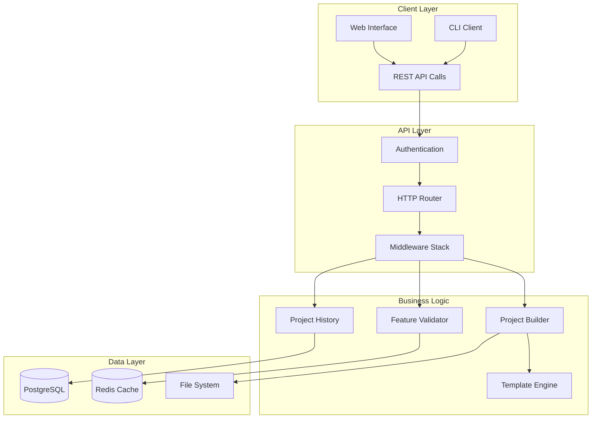
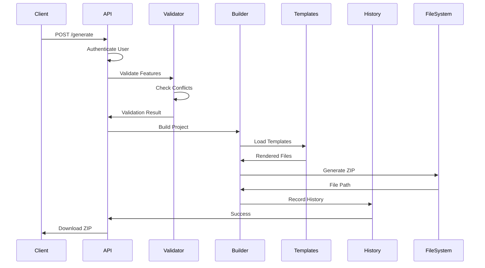
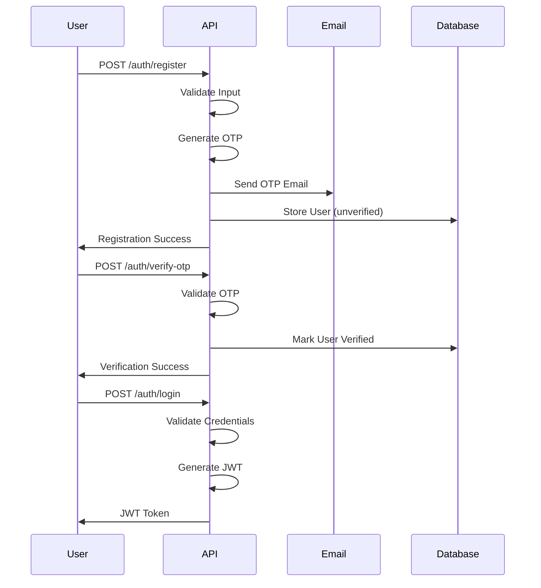

# 🏗️ GoCraft Architecture

## Overview

GoCraft is designed as a modular, scalable Go microservice generator with a clean architecture that separates concerns and enables easy extension.

## System Architecture



## Core Components

### 1. API Layer (`internal/api/`)

**Router (`router.go`)**
- HTTP route definitions
- Middleware registration
- CORS configuration
- Health check endpoints

**Handlers (`internal/handlers/`)**
- Request/response handling
- Input validation
- Business logic coordination
- Error handling

### 2. Authentication System (`internal/auth/`)

**Features:**
- JWT token generation/validation
- OTP email verification
- Password hashing (bcrypt)
- Role-based access control

**Components:**
- `jwt.go` - Token management
- `otp.go` - Email verification
- `middleware.go` - Auth middleware

### 3. Project Builder (`internal/builder/`)

**Core Engine:**
```go
type ProjectBuilder struct {
    templateEngine *TemplateEngine
    validator      *FeatureValidator
    fileManager    *FileManager
}
```

**Process Flow:**
1. **Validation** - Check feature compatibility
2. **Template Selection** - Choose appropriate templates
3. **Code Generation** - Generate project files
4. **Packaging** - Create ZIP archive
5. **History Recording** - Save project metadata

### 4. Template System (`internal/templates/`)

**Template Structure:**
```
templates/
├── frameworks/
│   ├── gin/
│   ├── echo/
│   └── fiber/
├── databases/
│   ├── postgresql/
│   ├── mysql/
│   └── mongodb/
├── features/
│   ├── auth/
│   ├── redis/
│   └── swagger/
└── base/
    ├── main.go.tmpl
    ├── go.mod.tmpl
    └── .env.example.tmpl
```

**Template Engine:**
- Go template parsing
- Variable substitution
- Conditional rendering
- File generation

### 5. Feature Validation (`internal/validation/`)

**Conflict Detection:**
```go
type ConflictRule struct {
    Features    []string
    Message     string
    Suggestions []string
}
```

**Validation Rules:**
- Database conflicts (PostgreSQL + MongoDB)
- Framework conflicts (Gin + Echo)
- Dependency resolution (Auth → JWT)

### 6. Project History (`internal/services/`)

**Data Models:**
```go
type ProjectHistory struct {
    ID               uint
    UserID           uint
    ProjectName      string
    Framework        string
    Features         []string
    ZipFilePath      string
    GenerationTime   time.Duration
    CreatedAt        time.Time
}
```

**Features:**
- Project tracking
- File management
- Statistics generation
- Cleanup automation

## Data Flow

### Project Generation Flow



### Authentication Flow



## Database Schema

### Users Table
```sql
CREATE TABLE users (
    id SERIAL PRIMARY KEY,
    email VARCHAR(255) UNIQUE NOT NULL,
    password VARCHAR(255) NOT NULL,
    role VARCHAR(20) DEFAULT 'user',
    otp VARCHAR(6),
    otp_expires_at TIMESTAMP,
    is_verified BOOLEAN DEFAULT FALSE,
    created_at TIMESTAMP DEFAULT NOW(),
    updated_at TIMESTAMP DEFAULT NOW()
);
```

### Project History Table
```sql
CREATE TABLE project_history (
    id SERIAL PRIMARY KEY,
    user_id INTEGER REFERENCES users(id) ON DELETE CASCADE,
    project_name VARCHAR(100) NOT NULL,
    framework VARCHAR(20) NOT NULL,
    features JSONB NOT NULL,
    adjusted_features JSONB NOT NULL,
    zip_file_path VARCHAR(500),
    zip_file_size BIGINT,
    zip_file_status VARCHAR(20) DEFAULT 'available',
    generation_duration_ms INTEGER,
    created_at TIMESTAMP DEFAULT NOW(),
    updated_at TIMESTAMP DEFAULT NOW()
);
```

## Security Architecture

### Authentication & Authorization

1. **JWT Tokens**
   - HS256 signing algorithm
   - 24-hour expiration
   - User ID in payload

2. **Role-Based Access**
   - `user` - Basic project generation
   - `admin` - System administration

3. **Input Validation**
   - Request sanitization
   - SQL injection prevention
   - XSS protection

### Security Middleware Stack

```go
// Middleware order (important!)
app.Use(cors.New())           // CORS headers
app.Use(rateLimiter())        // Rate limiting
app.Use(sanitizer())          // Input sanitization
app.Use(requireAuth())        // Authentication
app.Use(requireAdmin())       // Authorization (admin only)
```

## Performance Considerations

### Caching Strategy

1. **Template Caching**
   - Parsed templates cached in memory
   - Cache invalidation on template updates

2. **Statistics Caching**
   - User statistics cached for 5 minutes
   - Dashboard data cached for 1 minute

3. **Database Optimization**
   - Proper indexing on frequently queried columns
   - Connection pooling
   - Query optimization

### File Management

1. **ZIP Generation**
   - Streaming ZIP creation for large projects
   - Temporary file cleanup
   - Concurrent file operations

2. **Storage Cleanup**
   - Automatic cleanup of files older than 30 days
   - Orphaned file detection
   - Background cleanup processes

## Scalability

### Horizontal Scaling

1. **Stateless Design**
   - No server-side sessions
   - JWT for authentication
   - Database for persistence

2. **Load Balancing**
   - Health check endpoints
   - Graceful shutdown
   - Connection draining

### Database Scaling

1. **Read Replicas**
   - Separate read/write connections
   - Query routing based on operation type

2. **Connection Pooling**
   - Configurable pool size
   - Connection lifecycle management

## Monitoring & Observability

### Health Checks

- `/health` - Basic application health
- `/ready` - Database connectivity check
- `/metrics` - Prometheus metrics (planned)

### Logging

1. **Structured Logging**
   - JSON format for production
   - Contextual information
   - Error tracking

2. **Audit Logging**
   - User actions
   - Admin operations
   - Security events

### Metrics (Planned)

- Request latency
- Error rates
- Active users
- Project generation statistics

## Extension Points

### Adding New Features

1. **Template Creation**
   - Add template files in `internal/templates/features/`
   - Update feature registry
   - Add validation rules

2. **Framework Support**
   - Create framework templates
   - Update router generation
   - Add framework-specific middleware

3. **Database Integration**
   - Add connection templates
   - Update migration templates
   - Add ORM configurations

### Plugin Architecture (Future)

```go
type Plugin interface {
    Name() string
    Templates() []Template
    Conflicts() []ConflictRule
    Dependencies() []string
}
```

This architecture ensures GoCraft remains maintainable, extensible, and scalable as it grows.